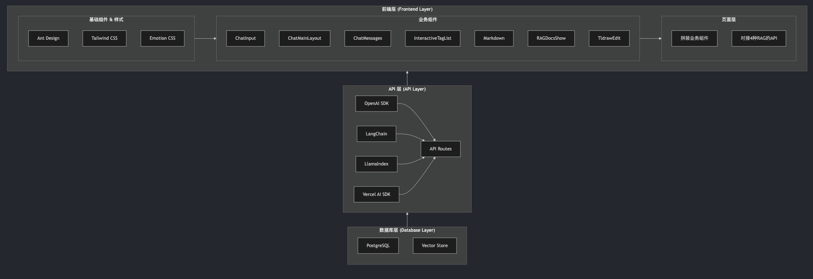

# private-component-codegen

基于私有组件的生成业务组件代码的 AI RAG 应用，分别使用了 OpenAI SDK、LangChain、LlamaIndex、Vercel AI SDK 来实现 RAG 功能。

## 项目架构



## 技术栈

- Next.js
- Ant Design
- Tailwind CSS
- TypeScript
- Drizzle ORM
- PostgreSQL
- OpenAI SDK
- LangChain
- LlamaIndex
- Vercel AI SDK

## 项目目录结构

```bash
├── app
│ ├── api // api 路由
│ │ ├── openai
│ │ ├── langchain
│ │ ├── llamaindex
│ │ ├── vercelai
│ ├── components // 业务组件
│ ├── openai-sdk // 对接 OpenAI SDK 的 page
│ ├── langchain // 对接 LangChain 的 page
│ ├── llamaindex // 对接 LlamaIndex 的 page
│ ├── vercel-ai // 对接 Vercel AI 的 page
│ ├── page.tsx // 入口
├── lib
│ ├── db // 数据库
│ │ ├── openai
│ │ │ ├── schema.ts
│ │ │ ├── selectors.ts
│ │ │ ├── actions.ts
│ │ ├── vercelai
│ │ │ ├── schema.ts
│ │ │ ├── selectors.ts
│ │ │ ├── actions.ts
```

## 快速开始

### 配置环境变量

```bash
cp .env.template .env
```

编辑 `.env` 文件，配置环境变量

```bash
# 数据库连接字符串：从supabase中获取（https://supabase.com/）
DATABASE_URL=postgresql://
# 嵌入模型
EMBEDDING=text-embedding-ada-002
# 大模型 API Key
AI_KEY=sk-xxx
# 大模型 API Base URL
AI_BASE_URL=https://api
# 大模型
MODEL=gpt-4o
```

### 启动项目

```bash
# pnpm version >= 9
pnpm install

# 启动storybook业务组件文档
pnpm storybook

# 初始化数据库
pnpm db:migrate

# 初始化embeddings
pnpm openai:embedding
pnpm langchain:embedding
pnpm llamaindex:embedding
pnpm vercelai:embedding

# 启动项目
pnpm dev
```
